<h3><code>lakshay@github ~ $ ./contributions.sh</code></h3>

  

<h3><code>lakshay@github ~ $ whoami</code></h3>

<table>
<tr>
<td valign="top"></td>
<td valign="top"></td>
</tr>
</table>

  

<b>Bachelor of Computer Science student · Cloud Technologies · Full Stack Development</b>

